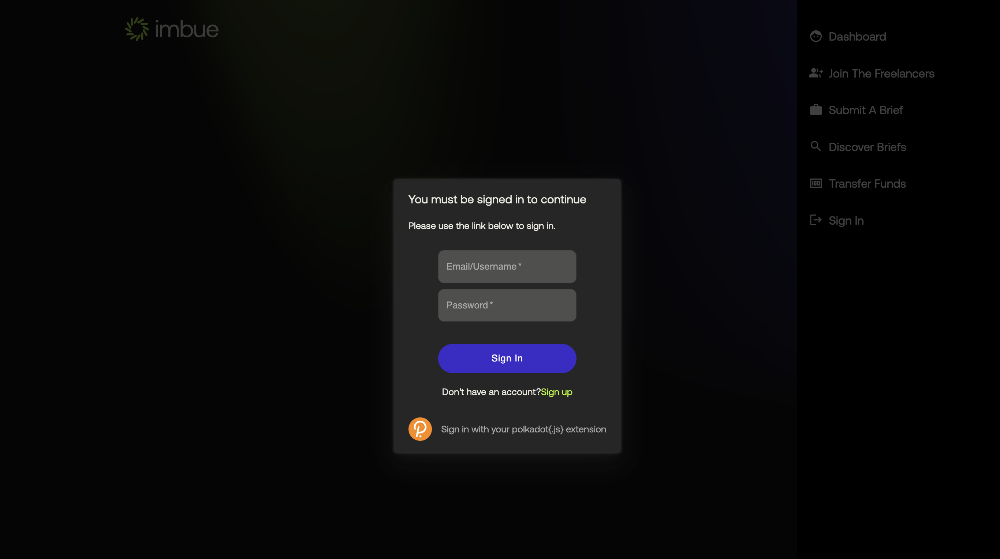
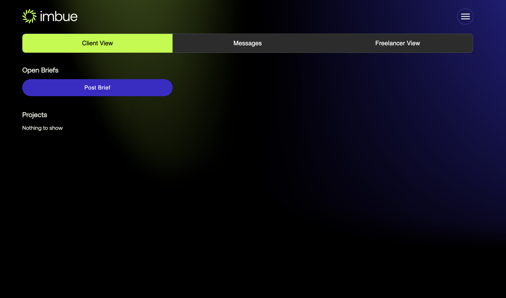

## Login Flow

#### Here we will go through how you can play with your app and test it's functionalities.
 - Step 1: Go to the http://localhost:3000/ and you will see the following page.
          

 - Step 2: click on the right-side menu as shown in the image above, and you will see the following page.
           here you see a lot of options, we will go over them one by one.
          

 - Step 3: First of all we have to login and you can click in the login button. We have two options to either signup using your email or 
            can use the polkadotjs extension to login. 
   - First we will go with the email option. Click on the signup
                button, enter your details and click on the create account button. 
            
   - Secondly we have the option to signin using polkadotjs(or any substrate based wallet), click on the signin with polkadotjs extension
     you will see something like shown below which is list of accounts in your wallet, please select any one of them and signin as shown below
     
       
     
     
 - Step 4: Upon signup you will be redirected to the dashboard page, as shown in the image below.
          