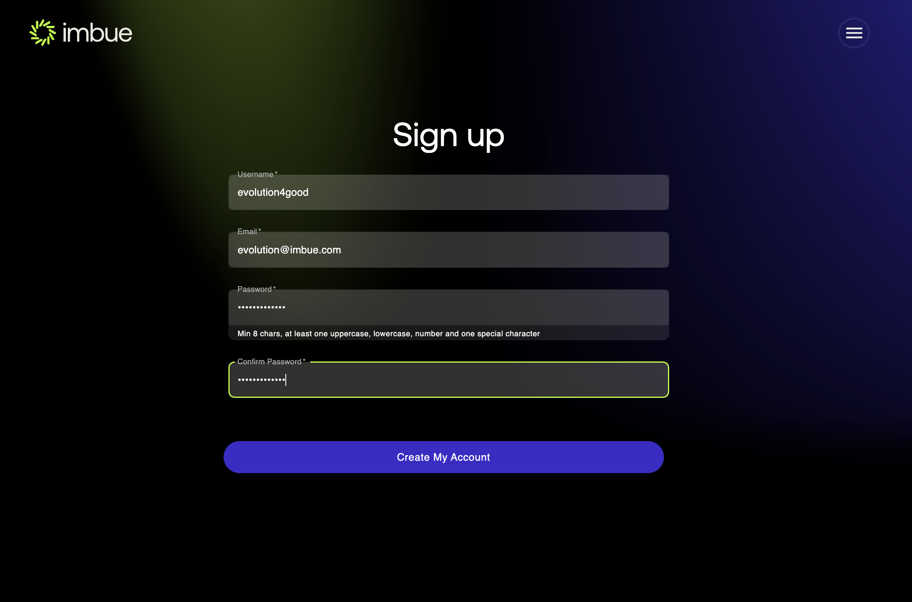
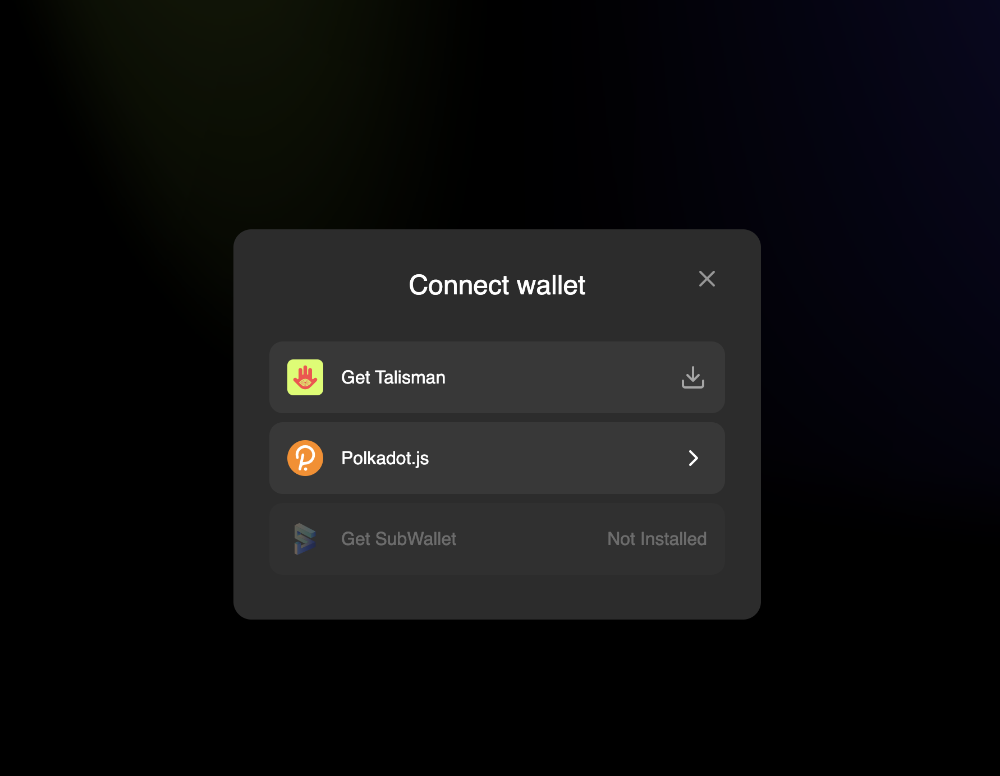

## Login Flow

#### Here we will go through how you can play with your app and test it's functionalities.
- Step 1: Go to the http://localhost:3000/ and you will see the following page.
          

 - Step 2: click on the right-side menu as shown in the image above, and you will see the following page.
           here you see a lot of options, we will go over them one by one.
          

 - Step 3: First we have to log in and you can click in the login button. We have multiple options to signup using your email, google account or 
            can use any supported wallet  to login.
   - For the login via email. Click on the signup button, enter your details and click on the create account button. 
     
   <br/><br/>
   - With the Google signup you can just click on the ```Sign in  with Google``` button, and it will redirect you to the Google login page, 
            where you can enter your Google credentials and login
   <br/><br/>
   - For the options with the wallet we can choose from different wallets as shown below
     
        - For any of the extension wallet, you can download the extension from the chrome store and 
           then click on the signin with the given supported wallet. Here we will go over polkadotjs extension wallet
   <br/><br/>
   - For polkadotjs(or any substrate based wallet, here we will be showing with the polkadotjs extension), click on the signin with polkadotjs extension
     you will see something like shown below which is list of accounts in your wallet, please select any one of them and signin as shown below
     
   <br/><br/>
     
   <br/><br/>
 - Step 4: Upon signup you will be redirected to the dashboard page, as shown in the image below.
          
   <br/><br/>