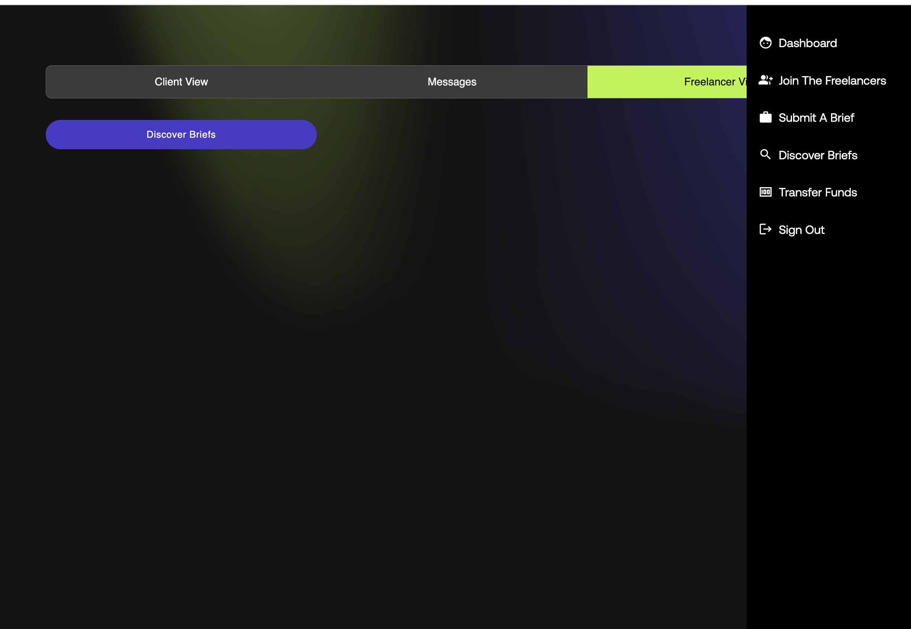
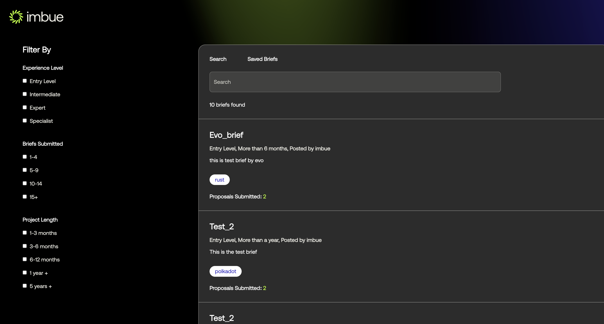

## Brief Flow

#### Viewing the existing briefs
     Upon successful login you will be redirected to the dashboard page, as shown in the image below.

 - Step 1: From the dashboard view you either click into the freelancer view or go the menu and click the discover 
          briefs button, as shown below
     
   
     
   
 - Step 2: Once you click you can see the list of briefs as shown below
     
   
     
 - Step 3: You can go through all the briefs can also filter through based in certain criteria and 
     click on the search button as shown below to apply the filters
     
   
     