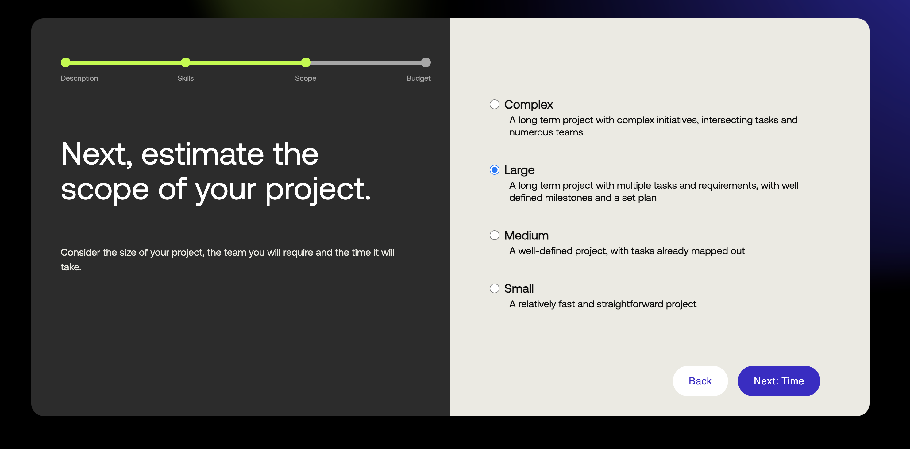

## Brief Flow

### Viewing the existing briefs
     Upon successful login you will be redirected to the dashboard page, as shown in the image below.

 - Step 1: From the dashboard view you either click into the freelancer view or go the menu and click the discover 
          briefs button, as shown below
   <br/><br/>
   
   <br/><br/>
   
 - Step 2: Once you click you can see the list of briefs as shown below
   <br/><br/>
   
   <br/><br/>
 - Step 3: You can go through all the briefs can also filter through based in certain criteria and 
     click on the search button as shown below to apply the filters
   <br/><br/>
   
   <br/><br/>


### Submitting/Posting a brief

- Step 1: From the dashboard view you either click into the client view or go the menu and click the post 
          briefs button, as shown below
   <br/><br/>
   
   <br/><br/>
   
 - Step 2: Now you can click either ```Post a Brief``` from the Client View or ```Submit a Brief``` from the main menu. You will see the 
           below screen
   <br/><br/>
   
   <br/><br/>
 - Step 3: Enter the headline and click next to enter the industry you project falls under as shown below 
   <br/><br/>
   
   <br/><br/>
 - Step 4: Enter the industry and click next to enter the description for your project
   <br/><br/>
   
   <br/><br/>
 - Step 5: Enter the description and click next to enter the skills required for your project
   <br/><br/>
   
   <br/><br/>
 - Step 6: Enter the skills and click next to enter experience level required
   <br/><br/>
   
   <br/><br/>
 - Step 7: Enter the experience level and click next to enter the scope for your project
   <br/><br/>
   
   <br/><br/>
 - Step 8: Enter the scope and click next to enter the estimate about how long your project will take
   <br/><br/>
   
   <br/><br/>
 - Step 9: Enter the time estimate and click next to enter the budget for your project
   <br/><br/>
   
   <br/><br/>
 - Step 10: Enter the budget and submit and you will be shown the thank you page
   <br/><br/>
   
   <br/><br/>
 - Step 11: You can now go to the discover briefs page and see your brief listed there as shown below
   <br/><br/>
   
   <br/><br/>