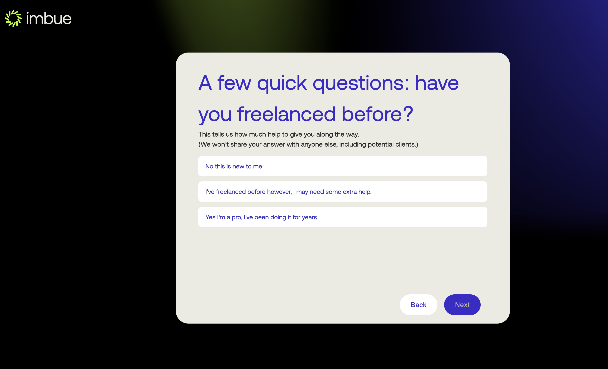
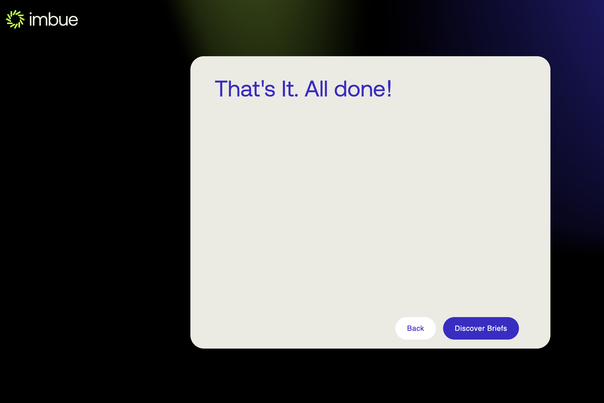

#### Freelancer Flow

##### Creating the freelancer profile
Before you can submit a proposal for a brief you need to have a freelancer profile created

 - Step 1: From the dashboard view go the menu and click the ```Join 
          the freelancer``` button, as shown below
   <br/><br/>
   
   <br/><br/>
 - Step 2: Upon clicking you will be redirected to the freelancer profile creation getting started page as, and you can click the ```Get Started``` button.
           You will be asked about your skills and experience in the next pages
   <br/><br/>
   
   <br/><br/>
 - Step 3: Next page after clicking ```Get Started``` button, you will be asked whether you have freelanced before as shown below
   <br/><br/>
   
   <br/><br/>
 - Step 4: Select your option and click next to enter about your freelancing goals
   <br/><br/>
   
   <br/><br/>
 - Step 5: Click next to enter the title for freelancing profile
   <br/><br/>
   
   <br/><br/>
 - Step 6: Enter the title and click next to enter the languages you know
   <br/><br/>
   
   <br/><br/>
 - Step 7: Enter the languages and click next to enter the skills you have
   <br/><br/>
   
   <br/><br/>
 - Step 8: Enter the skills and click next to enter a brief bio about yourself
   <br/><br/>
   
   <br/><br/>
 - Step 9: Enter the bio and click next to enter the main services you offer
   <br/><br/>
   
   <br/><br/>
 - Step 10: Enter the services and click Submit, you will be shown with the Done page, and from there you can go to the Discover briefs page
   <br/><br/>
   
   <br/><br/>
