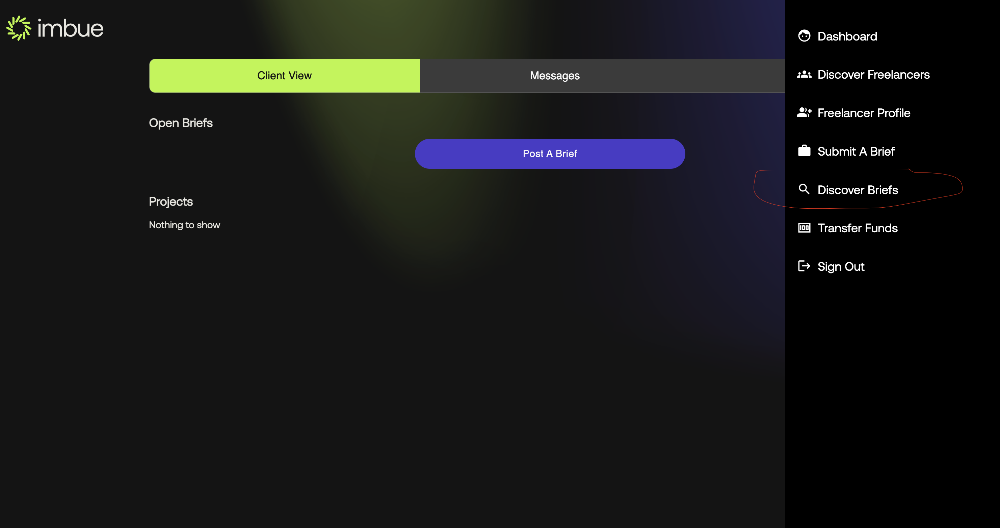
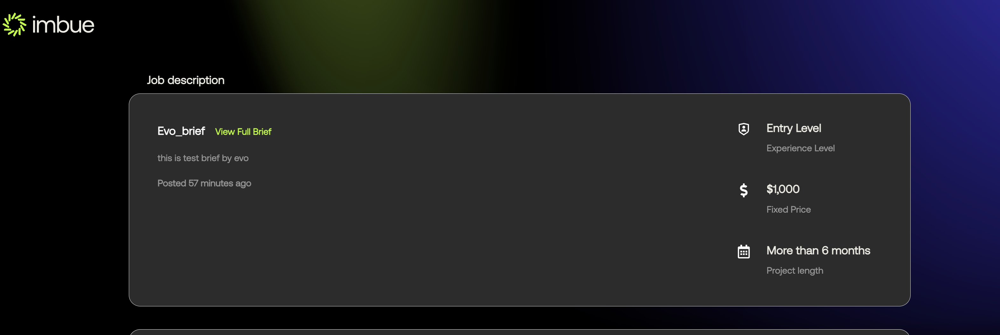
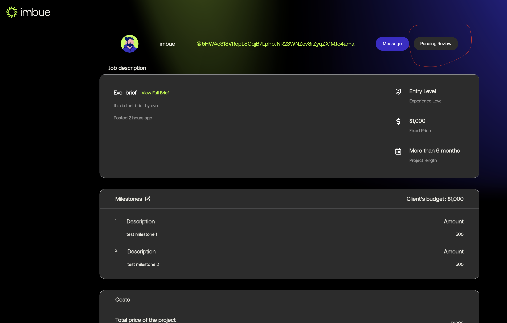

#### Submitting a proposal for a brief

  Once you have your freelancer profile set. As freelancer you can submit a proposal for a brief, and the brief creator can accept or reject your proposal
    <br/><br/>
  - Step 1: From the dashboard view go the menu and click the ```Discover briefs``` button, as shown below
    <br/><br/>
    
    <br/><br/>
  - Step 2: Upon clicking you will be redirected to the discover briefs page as shown below
    <br/><br/>
    
    <br/><br/>
  - Step 3: Click on the brief you want to submit a proposal for, and you will be redirected to the brief details page as shown below
     For this example we will be submitting a proposal for the brief ```Evo_brief```
    <br/><br/>
    
    <br/><br/>
     Here in brief details page you can see the client contact history and also could find the similar project in our imbue portal
     <br/><br/>
  - Step 4: Click on the ```Submit Proposal``` button, and you will be redirected to the submit proposal page as shown below
     <br/><br/>
     Here you can see a lot of details in multiple sections, lets discuss each in details
     <br/>
     **First Section** gives you the job description of the brief and some important details in short. You can click on the ```View Full Brief``` link to see the full brief details
     <br/><br/>
    
     <br/><br/>
     **Second Section** gives you the details about the milestones as shown below, here you can add more milestones(by clicking into ```Add Milestone``` button)
      and add amount for each milestones
    <br/><br/>
    
    <br/><br/>
    **Third Section** gives you the details about the payment terms like the timing and the currency you will like to receive your payment in
     (we support multiple currency)
    <br/><br/>
    
    <br/><br/>
  - Step 5: Enter all the proposal details and click submit, you will be shown that your brief is now pending with the brief owner as shown below
    <br/><br/>
    
    <br/><br/>